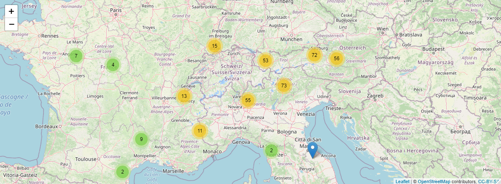

# Hawkers classification: 
<p float="center">


</p>

## Table of contents
<!--ts-->
- [1.0.0 Project overview](#Project-overview)
- [1.1.0 Introduction](#Introduction)
- [2.0.0 Material and methods](#Material-and-methods)
- [3.0.0 The dataset](#The-dataset)
- [3.1.0 Data cleaning](#Data-cleaning)
    - [3.1.1 Coordinates](#Coordinates)
    - [3.1.2 Geographical region](#Geographical-region)
    - [3.1.2 Selecting variables](#Selecting-variables)
- [4.1.0 Data extraction](#Data-extraction)
- [4.1.0 Feature engineering and data editing](#Feature-engineering-and-data-editing) 
- [5.1.0 Exploratory data analysis](#Exploratory-data-analysis) 
<!--te-->

## Project overview
* Classify two dragonfly species (Aeshna cyanea, Aeshna juncea) using three supervised learning strategies and a set of environmental feaures used as predictors.
* Verify if the two species distribution overlaps or if they can potentially share the same habitats.
* Scraped over 1000 occurrences data from  GBIF and using python and spocc.
* Clean data removing occurrences with wrong coordinates using clean_coordinates
* Subsetting only european countries which host - even partially - the alpine region
* Extracting climatic and environmental data from [Worldclim Bioclim](https://www.worldclim.org/data/bioclim.html) and [Corine Land Cover](https://land.copernicus.eu/pan-european/corine-land-cover) rasters, 
* Summary statistics to descibe Hawkers ecological conditions
* Linear discriminant analysis, logistic regression and random forest algorhytm to look for the best classification algorhytm

## Introduction
The southern hawker or blue hawker (Aeshna cyanea) is a species of hawker dragonfly. The species is one of the most common and most widespread dragonflies in Europe. The total range is West Palearctic and covers a large part of Europe (to Scotland and southern Scandinavia in the North to Italy (without the Southwest) and the northern Balkans to the South); the Eastern boundary is formed by the Ural and the West by Ireland. It is also found in Northwest Africa (Algeria). In Central Europe the species is very common
(since the alogtyhtm peromofrs weel they can be tested on more species to asses also conservations status and potential risk and addressing to cinservation soultion)

## Material and methods
* R Studio verion: 3.6.3
* Packages: 
    * occurences download: [```spocc```](https://cran.r-project.org/web/packages/spocc/spocc.pdf)
    * data cleaning: [```CoordinateCleaner```](https://cran.r-project.org/web/packages/CoordinateCleaner/CoordinateCleaner.pdf)
    * data extraction: [```rgdal```](https://cran.r-project.org/web/packages/rgdal/rgdal.pdf), [```raster```](https://cran.r-project.org/web/packages/raster/raster.pdf),
    [```sp```](https://cran.r-project.org/web/packages/sp/sp.pdf)
    * summary statistics: [```ggplot2```](https://cran.r-project.org/web/packages/ggplot2/ggplot2.pdf), 
    [```corrplot```](https://cran.r-project.org/web/packages/corrplot/corrplot.pdf)
    * modeling: [```MASS```](https://cran.r-project.org/web/packages/MASS/MASS.pdf), [```randomForest```](https://cran.r-project.org/web/packages/randomForest/randomForest.pdf)
* [GBIF](https://www.gbif.org/)
* [worldclim bioclim](https://www.worldclim.org/data/bioclim.html)
* [corine land cover IV level](https://land.copernicus.eu/pan-european/corine-land-cover)
  
## The dataset
The function ```occ``` within the ```spocc``` package has been used to retrieve 5000 occurrences for Aeshna cyanea and 5000 entryes for Aeshna juncea from the European contintent. A. cyanea dataset feature 112 variables while A. juncea 140. Both dataset follow [The Darwin Core](https://dwc.tdwg.org/) standard as required by GBIF. 

## Data cleaning
### Coordinates
Since occurences coordinates will be used to extract environmental and climatic data from raster our priority is to check the reliability of registered positions. The function 
```clean_coordinates``` has been used to flagging of common spatial and temporal errors. The function flag and exclude records assigned to country or province centroid, the open ocean, the headquarters of the Global Biodiversity Information Facility, urban areas or the location of biodiversity institutions. To furtherly increase data quality observations with more than 1000 m of coordinate uncertainty have been discarded. 

### Geographical region
The project is focused to discriminate species across the alpine region. Thus only occurrences falling into boundaries of Austria, Belgium, France, Germany, Italy , Luxembourg, Netherlands, Slovenia and Switzerland have been retained.



### Selecting variables
Only the following variable of the original [Darwin Core](https://dwc.tdwg.org/) format have been considered usefull for the project goal. At the end of the data cleaning process data size has been reduced to 1640 entries.
  
| Variable      | Description   |
| ------------- | ------------- |
| ```species```       | The name ccording which the occurence has been recorded into GBIF databse  |
| ```scientificName```| The full scientific name, with authorship and date information if known  | 
| ```longitude```    | The geographic longitude expressed in decimal degrees (WGS84)  | 
| ```latitude```      | The geographic latitude expressed in decimal degrees (WGS84)   | 
| ```elevation```       | Elevation (altitude) in meters above sea level  | 
| ```countryCode```  | The standard code for the country in which the Location occurs | 
| ```stateProvince``` | The name of the next smaller administrative region than country in which the Location occurs | 
| ```day```  | The integer day of the month on which the Event occurred.  | 
| ```month```  | The integer month in which the Event occurred | 
| ```year```  | The four-digit year in which the Event occurred, according to the Common Era Calendar  | 
| ```eventDate```  | The date-time or interval during which an Event occurred. For occurrences, this is the date-time when the event was recorded. Not suitable for a time in a geological context. | 
| ```endDayOfYear```  | The latest integer day of the year on which the Event occurred  | 

## Data extraction
Data extraction from rasters has been carryed over using the ```raster``` function on previously loaded data. Bioclimatic variables are derived from the monthly temperature and rainfall values in order to generate more biologically meaningful variables (30 arc-seconds spatial resolution - Km<sup>2</sup>). Land cover (100 m spatial resolution  comes from the 2018 Corine Land Cover. CLC is referring to a European programme establishing a computerised inventory on land cover of the 27 EC member states and other European countries.

|Variable | Wordclim name    | Description|
|---------|-----|-----|
|```amt```| BIO01    |Annual Mean Temperature  |
|```mdr```| BIO02    |Mean Diurnal Range (Mean of monthly (max temp - min temp))  |
|```ist```| BIO03  |Isothermality (BIO2/BIO7) (×100)  |
|```tse```| BIO04     |Temperature Seasonality (standard deviation ×100)  |
|```maxtwam```| BIO05 |Max Temperature of Warmest Month  |
|```mintcom```| BIO06  |Min Temperature of Coldest Month  |
|```tar```| BIO07     |Temperature Annual Range (BIO5-BIO6)  |
|```mintwq```| BIO08  |Mean Temperature of Wettest Quarter  |
|```mintdrq```| BIO09 |Mean Temperature of Driest Quarter  |
|```mtwaq```| BIO10   |Mean Temperature of Warmest Quarter  |
|```mtcoq```| BIO11   |Mean Temperature of Coldest Quarter  |
|```ara```| BIO12     |Annual Precipitation  |
|```rawen```| BIO13   |Precipitation of Wettest Month  |
|```radrm```| BIO14   |Precipitation of Driest Month  |
|```pse``` | BIO15    |Precipitation Seasonality (Coefficient of Variation)  |
|```raweq```| BIO16   |Precipitation of Wettest Quarter  |
|```radrq```| BIO17   |Precipitation of Driest Quarter  |
|```rawaq```| BIO18   |Precipitation of Warmest Quarter  |
|```racoq```|  BIO19  |Precipitation of Coldest Quarter  |
|```ai``` |    -  |Aridity index values according De Martonne  |


## Feature engineering and data editing
To better describe the ecology of the two species some variables have been edited/engineered:
* **Aridity index** (```ai```): the aridity index has been calculated using the formula proposed by De Martonne. The index values have been splitted according climate type (```ai_climate```).
* **CLC value**: the value of the Corine Land Cover habitat has been converted according land cover type (```CLC_hab```).
* **Flight season**(```season```): to describe occurrences within monthly observations, days (```day```) have been grouped according period frome the ealiest to the latest week of the month.
* **Month**: this variable (```month```) has been converted from numerical to factor (```Month```) to look at frequency of occurrences along time.

## Exploratory data analysis
#### Summary statistics

Descriptrive statistics calculated for numerical variables
|Variable |n    |min    |1st qrt.          | median|mean   |3rd qrt.          |max   |range |sd       |var     |CV       |
|---------|-----|-------|------------------|-------|-------|------------------|------|------|---------|--------|---------|
|longitude|308  |1.56   |9.84              |10.18  |10.35  |11.75             |14.65 |13.09 |2.29     |5.23    |0.22     |
|latitude |308  |42.53  |46.46             |47.4   |48.73  |51.47             |54.7  |12.17 |3.05     |9.33    |0.06     |
|elevation|308  |1      |157               |1171.5 |1119.83|1864              |2587  |2586  |820.98   |674005.39|0.73    |
|day      |308  |1      |9                 |17     |16.54  |25                |31    |30    |8.96     |80.35   |0.54     |
|month    |308  |6      |7                 |8      |7.83   |8                 |10    |4     |0.77     |0.59    |0.1      |
|amt      |308  |-1.5   |2.1               |5.2    |5.11   |8.3               |9.9   |11.4  |3.02     |9.1     |0.59     |
|mdr      |308  |5.1    |7                 |7.8    |7.78   |8.5               |10.6  |5.5   |1.13     |1.27    |0.14     |
|ist      |308  |25     |29                |31     |30.76  |33                |36    |11    |2.13     |4.53    |0.07     |
|tse      |308  |5200   |5769.75           |6151.5 |6094.26|6330.25           |7220  |2020  |425.89   |181378.6|0.07     |
|maxtwam  |308  |9.1    |15.2              |19.45  |18.44  |21.9              |24.9  |15.8  |3.68     |13.56   |0.2      |
|mintcom  |308  |-12    |-8.83             |-7.1   |-6.33  |-2.8              |-0.2  |11.8  |3.1      |9.63    |-0.49    |
|tar      |308  |19.8   |23.1              |24.7   |24.77  |26.33             |31.3  |11.5  |2.31     |5.32    |0.09     |
|mintwq   |308  |-5.6   |9.2               |12.85  |11.52  |16.2              |17.7  |23.3  |5.27     |27.73   |0.46     |
|mintdrq  |308  |-7.7   |-4.6              |-0.55  |-0.15  |3.6               |13.1  |20.8  |4.68     |21.89   |-30.92   |
|mtwaq    |308  |-0.77  |-0.46             |-0.06  |-0.02  |0.36              |1.31  |2.08  |0.47     |0.22    |-30.92   |
|mtcoq    |308  |-0.77  |-0.46             |-0.06  |-0.02  |0.36              |1.31  |2.08  |0.47     |0.22    |-30.92   |
|ara      |308  |670    |774.5             |989    |1031.32|1251              |1722  |1052  |266.04   |70776.95|0.26     |
|rawen    |308  |73     |84                |124    |120.47 |147               |182   |109   |32.57    |1060.61 |0.27     |
|radrm    |308  |27     |43                |53     |57.58  |71                |129   |102   |19.6     |384.11  |0.34     |
|pse      |308  |7      |18                |24     |24.26  |31                |43    |36    |9.07     |82.23   |0.37     |
|raweq    |308  |215    |238               |344    |342.68 |418.25            |527   |312   |93.81    |8800    |0.27     |
|radrq    |308  |82     |139               |168    |187.42 |228               |403   |321   |64.97    |4221.33 |0.35     |
|rawaq    |308  |82     |139               |168    |187.42 |228               |403   |321   |64.97    |4221.33 |0.35     |
|racoq    |308  |82     |161.75            |183.5  |207.93 |255.25            |477   |395   |76.81    |5899.91 |0.37     |
|ai       |308  |36.49  |42.91             |66.57  |73.62  |92.99             |164.71|128.22|31.47    |990.12  |0.43     |


